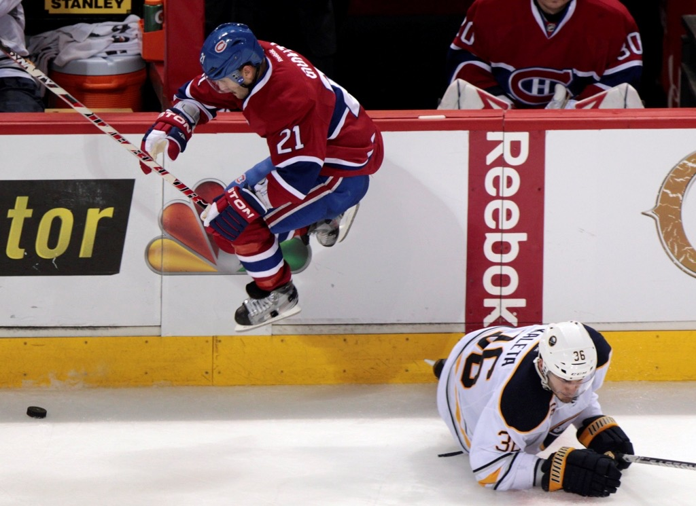
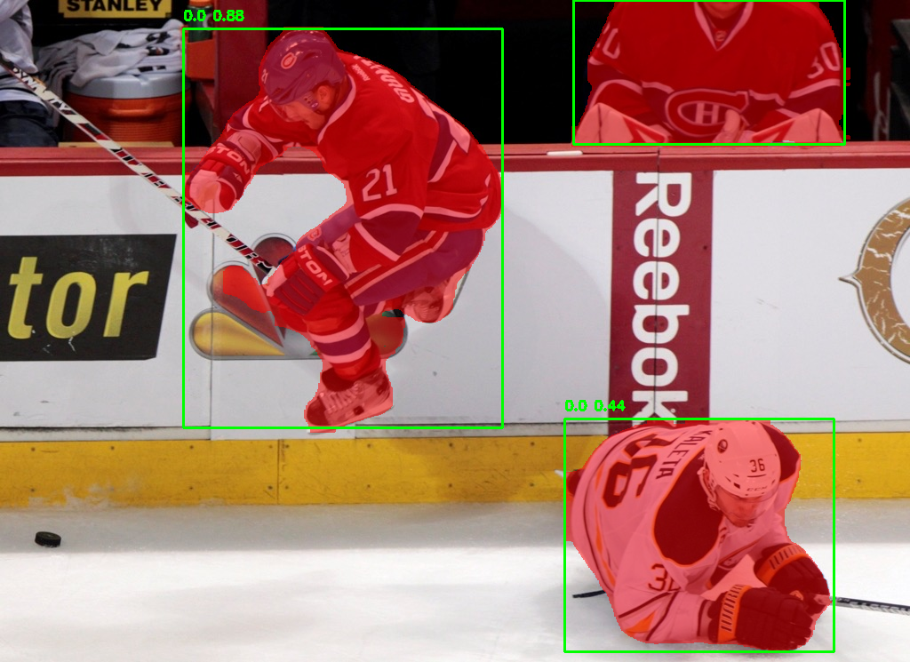
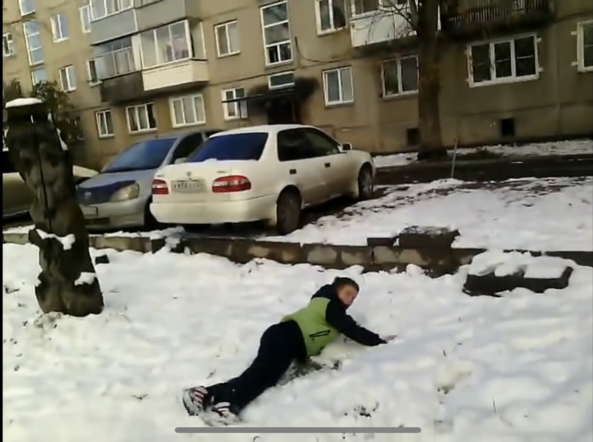
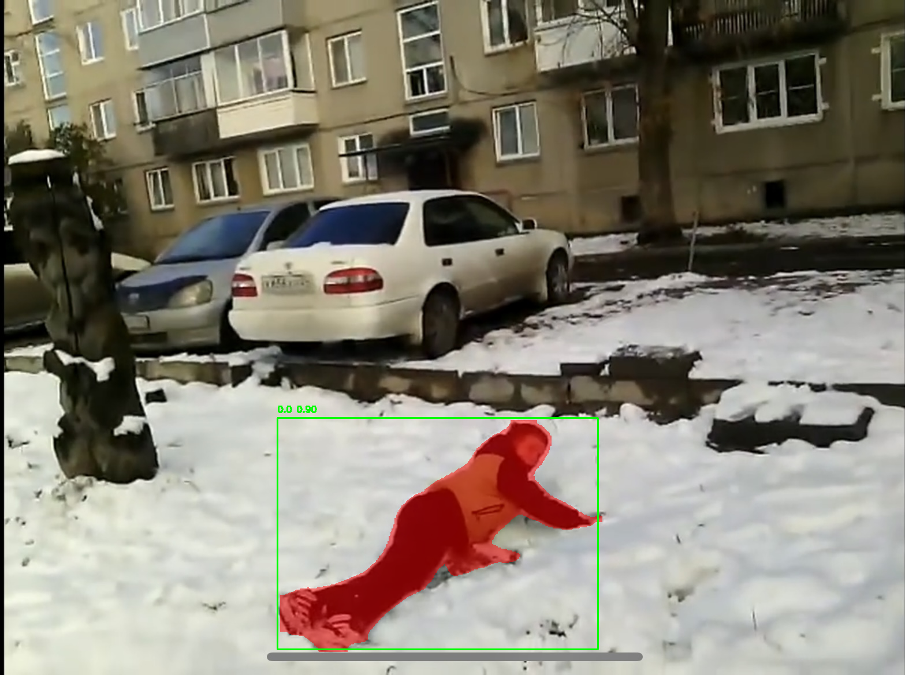
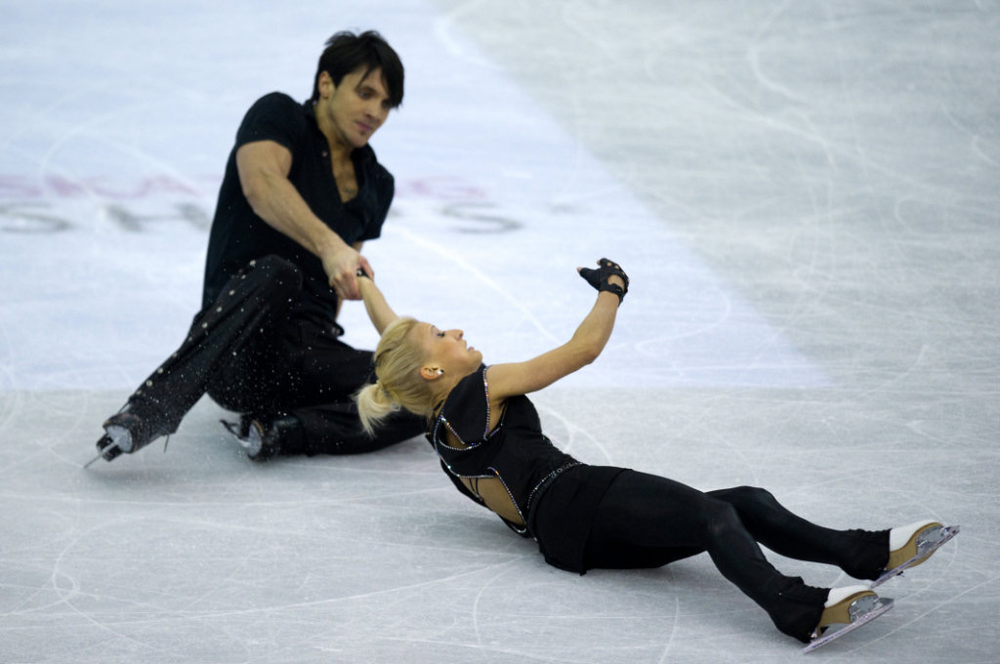
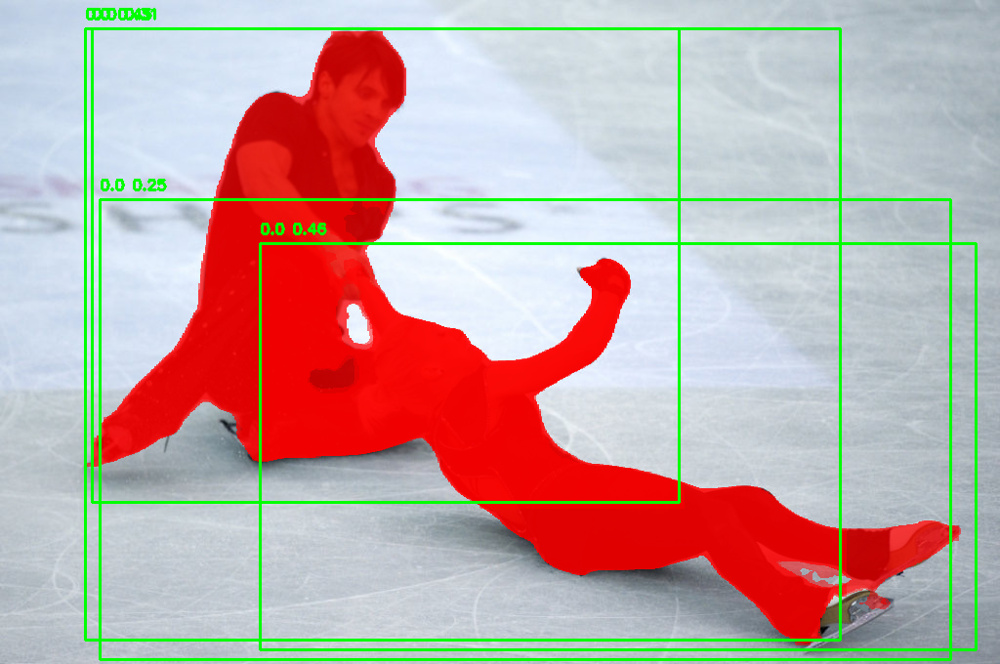
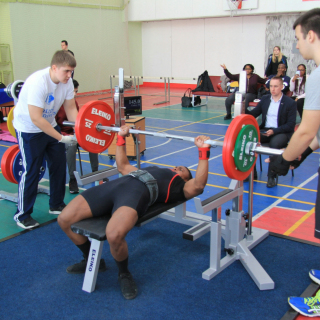
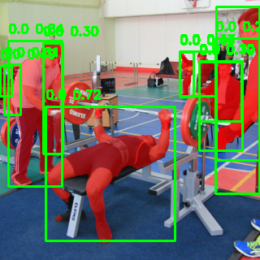

# Скачать репозиторий  
```
git clone https://github.com/AxuJIuyc/YOLO_HumanSegmentor.git
cd YOLO_HumanSegmentor
```

# Установить зависимости  
Note: Будут установлены torch и nvidia_cuda (> 1.5 GB)
```
pip install -r ./requirements.txt
```

# Запуск
```
python image_processor.py
```
Note: Прекратить воспроизведение можно по клавише `Q`

# Пример результатов
<table>
  <tr>
    <td></td>
    <td></td>
  </tr>
  <tr>
    <td></td>
    <td></td>
  </tr>
  <tr>
    <td></td>
    <td></td>
  </tr>
  <tr>
    <td></td>
    <td></td>
  </tr>
</table>
